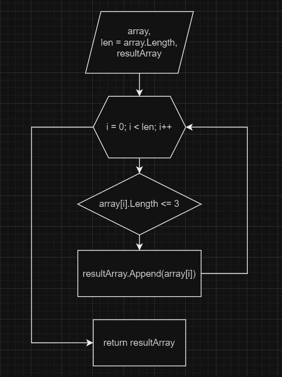

# Итоговая контрольная работа по основному блоку

## Задание:

    Написать программу, которая из имеющегося массива строк формирует новый массив из строк, длина которых меньше, либо равна 3 символам. Первоначальный массив можно ввести с клавиатуры, либо задать на старте выполнения алгоритма. При решении не рекомендуется пользоваться коллекциями, лучше обойтись исключительно массивами.

## Примеры:

- [“Hello”, “2”, “world”, “:-)”] → [“2”, “:-)”]
- [“1234”, “1567”, “-2”, “computer science”] → [“-2”]
- [“Russia”, “Denmark”, “Kazan”] → []

## Aлгоритм действий:

1. Задать массив строк
2. Вывести в консоль заданный массив
3. Выполнить поиск и запись строк длинны меньше либо равных 3 в новый массив
4. Вывод нового массива в консоль

## Блок-схема

Блок-схема основной содержательной части (пункт 3 в Алгоритме действий)

## Методы:

### void OutputStringArray(string[] array)

    Метод, выводящий в консоль массив строк в следующем формате: ['row1', 'row2', 'row3']

### string[] SearchString(string[] array, int countStringDigit = 3)

    Метод, принимающий на вход массив строк и количество символов (не обязательный параметр, по умолчанию равен 3), и возвращает новый массив с элементами старого массива, длина которых меньше или равна указанному количесву символов

### string[] InputStringArray()

    Метод, считывающий из консоли массив строк